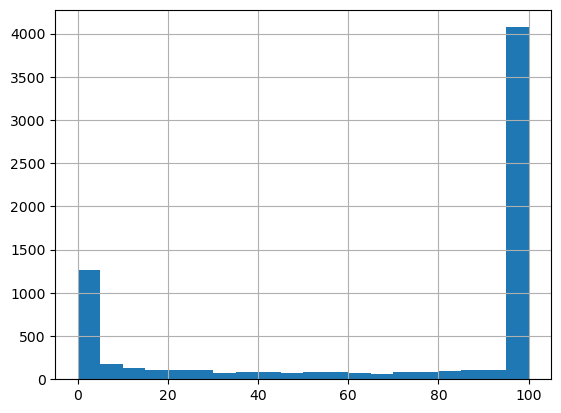

# Verification of the CRYO data 
Writing here the methodology followed to verify the data
snow cover data from CRYO againgst the snow cover data
from CARRA

## naive approach
The data provided in the snow_cryo files consists of points on a 5-10km grid,
mainly over Greenland. Since this part is covered by the carra_west domain
only this data will be used for the moment.
The files are provided once a day, with the format
```
snow_cryo_5-10km_2022100106.dat  snow_cryo_5-10km_2022101706.dat
snow_cryo_5-10km_2022100206.dat  snow_cryo_5-10km_2022101806.dat
snow_cryo_5-10km_2022100306.dat  snow_cryo_5-10km_2022101906.dat
snow_cryo_5-10km_2022100406.dat  snow_cryo_5-10km_2022102006.dat
snow_cryo_5-10km_2022100506.dat  snow_cryo_5-10km_2022102106.dat
snow_cryo_5-10km_2022100606.dat  snow_cryo_5-10km_2022102206.dat

```
And contents
```
20221006  6  77.47196  -105.57903  100.00  1
20221006  6  77.55873  -105.68999  100.00  1
20221006  6  77.64545  -105.80251  100.00  1
20221006  6  77.73211  -105.91662  100.00  1
20221006  6  77.49586  -105.18301  100.00  1
20221006  6  77.66968  -105.40137  100.00  1
...

```

where the first two columns are datetime ad hour, followed by lat and lon and the probability of snow. The last column is some sort of quality control flag.
The model data is provided as fractio of snow cover (shortName: fscov, grib2 parameter: 260289)

Since the data from CARRA is gridded and the observation data is not, they will
be put in the same grid using the scripts in the directory `scr`.

In order to compare both quantities, the information will be used to define
a binary quantity defining points with snow or no-snow.
Looking at the distribution of two sample dates from observation and forecast data.
For the observation, the histogram of snow probability generally looks like this

For the forecast, the histogram of fraction of snow cover looks like this


Based on these plots, will be selecting snow probabilities over 90 % as "snow" (1.0, otherwise "no snow" (0.0)
For the model, the threshold will be set at 80 %.

### Putting the data in the same format
In order to place the data in the same grid, a grib file from CARRA
in a regular lat lon grid will be used as template to place the snow data on the same grid.
Based on this, the points closest to the coordinates of the CARRA grid will be chosen,
using a nearest neighbour approach.
The values will be converted to snow or no snow following the thresholds above.

Note that the variable name "fscov" and parameter 260289 will continue to be used in the output grib file,
since changing the name of the parameter name in the grib to a dummy "snow_no_snow" variable
would imply creating a new variable definition in the grib tables.


